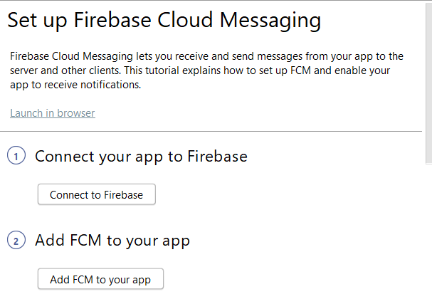

# Paso 1: Creación de la aplicación [!DNL Android] y configuración para usar [!DNL Firebase Cloud Messaging]

En esta parte creará la aplicación [!DNL Android] para recibir [!UICONTROL Push notifications] enviados desde Adobe Campaign Standard. Para recibir las notificaciones push, la aplicación debe registrarse con [!DNL Firebase Cloud Service] de Google.

1. Inicie sesión en su cuenta de [!DNL Firebase].

   [!DNL Firebase] es la plataforma móvil de Google que le ayuda a desarrollar rápidamente aplicaciones de alta calidad. Si no tiene una cuenta de [!DNL Firebase], cree una [desde aquí](https://firebase.google.com).

2. Iniciar [!DNL Android Studio]
3. Haga clic en **[!UICONTROL File]** > **[!UICONTROL New]** > **[!UICONTROL New Project].**
4. Seleccione **[!UICONTROL Empty Activity]** y haga clic en **[!UICONTROL Next].**

   

5. Proporcione un nombre significativo al proyecto.

   Para el propósito de esta demostración, hemos denominado a nuestro proyecto como *[!DNL ACSPushTutorial]*

   

6. Acepte los nombres de paquetes predeterminados y haga clic en **[!DNL Finish]** para crear su proyecto.
7. La estructura del proyecto debe ser similar a la captura de pantalla siguiente

   

8. Haga clic en **[!UICONTROL Tools]** > **[!UICONTROL Firebase].** (esto agrega el proyecto a [!DNL Firebase])
9. Haga clic en **[!UICONTROL Set up Firebase Cloud Messaging].**

   

10. Haga clic en **[!UICONTROL Connect to Firebase].**
11. Una vez que la aplicación esté conectada a Firebase, haga clic en **[!UICONTROL Add FCM to your app].**
12. Haga clic en **[!UICONTROL Accept Changes].**

   Cuando agregue FCM a la aplicación, el asistente necesitará su permiso para realizar algunos cambios en el proyecto.

   ![[!DNL add-fcm-to-your-app]](assets/firebase-add-fcm-to-app.PNG)

Si la integración de la aplicación con Firebase se realiza correctamente, recibirá un mensaje similar al que se muestra a continuación:

![[!DNL fcm-successfull]](assets/android-firebase-success.PNG)

[Asegúrese de que su proyecto esté en la lista de  [!DNL Firebase &#x200B;]consola](https://console.firebase.google.com/)

## Configurar la configuración de [!UICONTROL Push Channel]

1. Iniciar sesión en la consola [!DNL Firebase]
2. Abra el proyecto **[!UICONTROL ACSPushTutorial]**.
3. Haga clic en el **icono de engranaje** y abra la configuración del proyecto

   

4. Vaya a la ficha **[!UICONTROL Cloud Messaging]**.
5. Copiar la clave del servidor

   

6. Inicie sesión en su instancia de Adobe Campaign Standard
7. Haga clic en **[!UICONTROL Adobe Campaign]** > **[!UICONTROL Administration]** > **[!UICONTROL Channels]** > **[!UICONTROL Mobile App].**
8. Seleccione el(la) **[!UICONTROL Mobile Application Property]apropiado(a).**
9. Haga clic en el icono **[!DNL Android]** en la sección **[!UICONTROL Push Channel settings]**.
10. Pegue la clave del servidor en el campo server key.

Si todo va bien, debería ver un mensaje de ÉXITO.

En resumen, hemos creado un(a) [!DNL Android App] y conectado el(la) [!DNL Android App] con [!DNL Firebase]. A continuación, conectamos la aplicación móvil en Adobe Campaign con [!DNL Android App] pegando la clave del servidor de la aplicación [!DNL Android] en la aplicación móvil en Adobe Campaign Standard.
