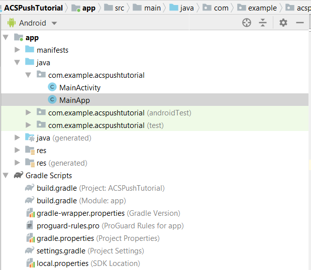

# PASO 2: Integrar [!UICONTROL Mobile SDK] con la aplicación de Android

En esta parte, integraremos la aplicación [!DNL Android] con [!UICONTROL Mobile SDK]. Para integrar [!UICONTROL mobile SDK] con la aplicación [!DNL Android], siga los siguientes pasos:

* Abrir el proyecto *ACSPushTutorial* en [!DNL Android Studio]
* Cree una nueva clase Java llamada *MainApp* que extienda [!DNL android.app.Application]
* La estructura del proyecto en este punto debería ser la siguiente



* Expanda la carpeta [!DNL Gradle Scripts]. Haga doble clic en [!DNL build.gradle] del módulo. Pegue las siguientes dependencias en la sección de dependencias del archivo [!DNL build.gradle]. El archivo de [!DNL build.gradle] debería tener el siguiente aspecto

<!--
Removed `{.line-numbers}` below
-->

```java
implementation 'com.adobe.marketing.mobile:campaign:1.+'
implementation 'com.adobe.marketing.mobile:userprofile:1.+'
implementation 'com.adobe.marketing.mobile:sdk-core:1.+'
```


* Sincroniza tu proyecto [!DNL Android] haciendo clic en el botón sincronizar ahora para sincronizar tu proyecto

## Modificar [!DNL AndroidManifest.xml]{#modify-android-manifest}

Abra *AndroidManifest.xml* y pegue las 2 líneas siguientes después del elemento de manifiesto y antes del elemento de aplicación. Esto permite que la aplicación se comunique con el mundo exterior

<!--
Removed `{.line-numbers}` below
-->

```xml
<uses-permission android:name="android.permission.INTERNET" />
<uses-permission android:name="android.permission.ACCESS_NETWORK_STATE" />
```

Copie la línea siguiente en el elemento de aplicación
[!DNL android:name=&quot;.MainApp&quot;]
Guarde su [!DNL AndroidManifest.xml]
Su [!DNL AndroidManifest.xml] debe tener un aspecto similar al siguiente

<!--
Removed `{.line-numbers}` below
-->

```xml
<?xml version="1.0" encoding="utf-8"?>
<manifest xmlns:android="http://schemas.android.com/apk/res/android"
    package="com.example.acspushtutorial">
    <uses-permission android:name="android.permission.INTERNET" />
    <uses-permission android:name="android.permission.ACCESS_NETWORK_STATE" />

<application
    android:name=".MainApp"
    android:allowBackup="true"
    android:icon="@mipmap/ic_launcher"
    android:label="@string/app_name"
    android:roundIcon="@mipmap/ic_launcher_round"
    android:supportsRtl="true"
    android:theme="@style/AppTheme">

<activity android:name=".MainActivity">
<intent-filter>
    <action android:name="android.intent.action.MAIN" />
    <category android:name="android.intent.category.LAUNCHER" />
</intent-filter>
</activity>
</application>

</manifest>
```
