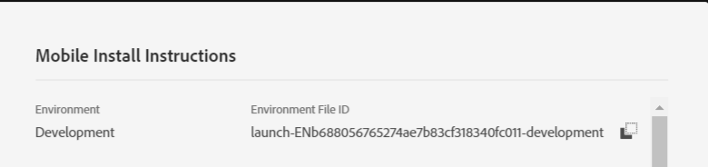

# Paso 3: Registro de extensiones con la aplicación móvil

En esta parte, agregamos el código para registrar las extensiones de perfil de usuario, identidad, ciclo vital y señal. También debemos registrar la extensión de Adobe Campaign Standard como se muestra en el siguiente código.

Abra el proyecto en [!DNL Android] Studio. Elimine todo el código en MainApp **excepto la primera línea, que es la instrucción del paquete**.

Pegue el siguiente código en MainApp

<!--
Removed `{.line-numbers}` below
-->

```java
import [!DNL android].app.Application;
import android.util.Log;

import com.adobe.marketing.mobile.AdobeCallback;
import com.adobe.marketing.mobile.Campaign;
import com.adobe.marketing.mobile.Identity;
import com.adobe.marketing.mobile.InvalidInitException;
import com.adobe.marketing.mobile.Lifecycle;
import com.adobe.marketing.mobile.LoggingMode;
import com.adobe.marketing.mobile.MobileCore;
import com.adobe.marketing.mobile.Signal;
import com.adobe.marketing.mobile.UserProfile;

public class MainApp extends Application {

@Override
public void onCreate() {
super.onCreate();

MobileCore.setApplication(this);
MobileCore.setLogLevel(LoggingMode.DEBUG);

try{
    Campaign.registerExtension();
    UserProfile.registerExtension();
    Identity.registerExtension();
    Lifecycle.registerExtension();
    Signal.registerExtension();
    MobileCore.start(new AdobeCallback () {
        @Override
        public void call(Object o) {
            MobileCore.configureWithAppID("copy your launch property id here");
        }
    });
} catch (InvalidInitException e) {
    Log.d("ACS Exception", "exception");
}
}
}
```

Línea 32: debe proporcionar el id. de archivo de entorno de su propiedad [!UICONTROL &#x200B; Launch]. Se puede obtener acceso a esto desde el [!UICONTROL environment tab] de su propiedad [!UICONTROL Launch].


